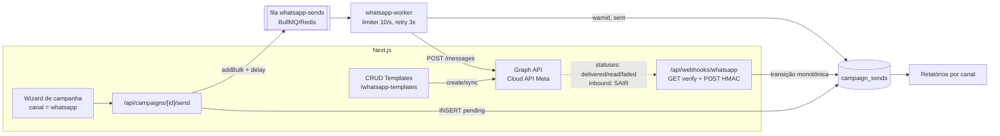

# Plano — Campanhas por WhatsApp no Avante Mail

> Pesquisa e plano de implementação gerados em 24/07/2026. Fontes no final.

## 1. Resumo executivo

- **Integração recomendada: WhatsApp Cloud API oficial da Meta, direta (sem BSP).** Sem custo de intermediário, é uma API HTTP simples (Graph API) e o projeto já tem o perfil de integrar provedores diretamente (SES via SMTP). APIs não-oficiais (Evolution/Baileys) ficam **descartadas** para disparo em massa: violam os Termos da Meta e o risco de banimento do número é alto e crescente.
- **Quase nada de stack nova.** O pipeline de email existente (campanha → `campaign_sends` → fila BullMQ → worker → provedor → webhook → relatório) é replicado como um segundo canal. Novidades: 1 dependência (`libphonenumber-js`), 1 fila, 1 worker, 1 webhook, 1 CRUD de templates e colunas novas no banco.
- **A regra que muda tudo:** campanha de marketing no WhatsApp **só pode usar template pré-aprovado pela Meta**. Não existe "editor livre" como no email — o editor vira um gerenciador de templates + mapeamento de variáveis.
- **Custo por mensagem é relevante:** marketing no Brasil ≈ **US$ 0,0625 por mensagem entregue** (≈ R$ 0,31–0,38). 1.000 envios ≈ US$ 62,50. O wizard deve mostrar o custo estimado antes do disparo.
- **Opt-in é obrigatório** (política Meta + LGPD). Consentimento de WhatsApp é separado do de email: coluna própria (`whatsapp_subscribed`, default `false`) e opt-out por palavra-chave ("SAIR") processado no webhook.

---

## 2. O que a pesquisa concluiu

### 2.1 Opções de integração

| Opção | O que é | Custo | Veredito |
|---|---|---|---|
| **Cloud API direta (Meta)** | API HTTP hospedada pela Meta (Graph API) | Só a tarifa Meta por mensagem | **Recomendada** — controle total, sem markup; exige cuidar de token, webhook e templates (que este plano cobre) |
| **BSP** (360dialog, Gupshup, Twilio, Zenvia…) | Revenda da mesma Cloud API com painel/serviços | Meta + markup (~US$ 0,003–0,01/msg) ou mensalidade (ex.: 360dialog ~€49/mês) | Desnecessária — o Avante Mail *é* a plataforma; BSP só terceirizaria o onboarding |
| **MM Lite API** | Variante da Cloud API otimizada p/ marketing (até ~9% mais entrega) | Igual à Cloud API | **Fase futura** — exige estar na Cloud API primeiro; reaproveita templates |
| **Não-oficial** (Evolution API, Baileys, WPPConnect…) | Engenharia reversa do WhatsApp Web | "Grátis" | **Não usar** — viola ToS; em 2025/2026 a Meta intensificou detecção por fingerprint de cliente; bans definitivos sem aviso, inclusive em volume baixo. Disparo em massa é exatamente o padrão mais caçado |

### 2.2 Regras da plataforma que moldam o design

1. **Templates obrigatórios.** Mensagem iniciada pela empresa = template aprovado (categorias `MARKETING`, `UTILITY`, `AUTHENTICATION`). Aprovação leva de minutos a ~24h; a Meta recategoriza template "utility" com cheiro de promoção para "marketing" e rejeita conteúdo vago (revisão possível em até 60 dias).
2. **Template pacing.** Template novo/alterado é entregue em ritmo controlado enquanto a Meta mede sinais (leitura, bloqueio). Feedback ruim → template pausado. Primeiro disparo de um template novo deve ser em lote pequeno.
3. **Limite de iniciação de conversas** por **portfólio de negócios** (não mais por número, desde out/2025): 250/24h (empresa não verificada) → 1.000 → 10.000 → 100.000 → ilimitado. Sobe automaticamente com qualidade média/alta + uso ≥50% do limite em 7 dias. **Verificar a empresa na Meta é pré-requisito para sair de 250.**
4. **Throughput técnico:** 80 msg/s por número (auto-upgrade até 1.000). Não é o gargalo — o gargalo é o limite diário acima.
5. **Frequency cap por destinatário (erro 131049).** A Meta limita quantas mensagens de *marketing* um usuário recebe por dia **somando todas as empresas** (≈2/dia, dinâmico por engajamento). Falhas 131049 são *esperadas* em qualquer campanha e não devem gerar retry em menos de 24h. O relatório precisa distinguir esse motivo.
6. **Webhooks:** eventos `sent` → `delivered` → `read` / `failed` por mensagem (`wamid`), inbound de respostas, status de template e alerta de qualidade do número. Assinados com HMAC-SHA256 (`X-Hub-Signature-256`, App Secret, comparação timing-safe sobre o **raw body**). **A ordem dos eventos não é garantida** → aplicar transições de estado monotônicas.
7. **Janela de 24h:** resposta do contato abre janela em que mensagens livres (sem template) são grátis — usada aqui só para confirmar opt-out; caixa de entrada/atendimento fica fora do escopo.
8. **Preços Brasil (por mensagem entregue, desde jul/2025):** Marketing ≈ US$ 0,0625 (R$ 0,31–0,38); Utility ≈ US$ 0,0068 (grátis dentro da janela de 24h); Authentication ≈ US$ 0,03; Service = grátis. Marketing **não tem** desconto por volume. Conferir a tabela vigente antes do go-live. Nota: marketing para números dos **EUA** está pausado pela Meta desde abr/2025 — irrelevante para base BR, mas o worker trata como falha normal.
9. **Qualidade do número:** rating (alto/médio/baixo) baseado em bloqueios/denúncias. Rating baixo derruba tier e pode restringir o número. Mitigação: opt-in real, frequência baixa, conteúdo relevante, warm-up gradual.

---

## 3. Stack necessária

### Reaproveitado (já existe no projeto)

| Peça | Uso no WhatsApp |
|---|---|
| BullMQ + Redis (`lib/queue.ts`) | Nova fila `whatsapp-sends`, mesmos delayed jobs p/ agendamento |
| Worker em Docker (`worker/email-worker.ts` + `compose.yaml`) | Novo serviço `whatsapp-worker`, mesma imagem |
| Drizzle + Postgres (`lib/db/schema.ts`) | Colunas/tabelas novas |
| Padrão de webhook (`app/api/webhooks/ses/route.ts`) | Molde do webhook Meta (o prefixo `/api/webhooks/` já é público no `middleware.ts` — zero mudança lá) |
| `campaign_sends` (com `provider_message_id`, `replied_at` já criado e não usado) | Mesmo outbox por destinatário; `provider_message_id` guarda o `wamid` |
| `sendEmail` (`lib/ses.ts`) | Alertas administrativos (qualidade do número caiu, template rejeitado) |
| Wizard, relatórios, listas/tags | Ramificados por canal |

### A adicionar

- **Nenhum SDK do WhatsApp.** O SDK Node oficial da Meta foi **arquivado**; a prática de mercado é chamar a Graph API com `fetch` nativo (Node 22 já tem). Mantém o padrão do repo (integração direta, sem camada de terceiros). Módulo novo: `lib/whatsapp.ts`, espelho de `lib/ses.ts`.
- **`libphonenumber-js`** (única dependência nova): normalização/validação de telefone para E.164 (`+5511999999999`), com país padrão BR.
- **Envs novas:** `WHATSAPP_API_VERSION` (ex.: `v23.0`), `WHATSAPP_PHONE_NUMBER_ID`, `WHATSAPP_WABA_ID`, `WHATSAPP_ACCESS_TOKEN` (token permanente de System User), `WHATSAPP_APP_SECRET` (assinatura do webhook), `WHATSAPP_WEBHOOK_VERIFY_TOKEN` (handshake GET), `WHATSAPP_MAX_SEND_RATE` (default 10/s), `WHATSAPP_DAILY_LIMIT` (tier atual, p/ aviso no wizard).
- **Infra:** nenhum serviço novo além do contêiner `whatsapp-worker` (mesma imagem). Nginx/certificado atuais já atendem o webhook. Em dev, webhook exige URL pública → `cloudflared tunnel` ou ngrok.

---

## 4. Arquitetura e padrões de projeto



Padrões aplicados (e por que):

- **Canal como discriminador, não como framework.** `campaigns.channel` (`"email" | "whatsapp"`) + filas/workers separados, mas **mesma** tabela de envios, mesmo ciclo de status de campanha e mesmos relatórios. O repo usa funções puras em `lib/`, não classes — replicar o molde (`lib/whatsapp.ts` irmão de `lib/ses.ts`) vale mais que introduzir uma interface `ChannelProvider` prematura. Se um 3º canal surgir (SMS), aí sim extrair a abstração.
- **Transactional Outbox** — já é o desenho atual: os envios nascem `pending` no Postgres (fonte da verdade) e a fila só carrega ponteiros (`sendId`). Crash do Redis não perde campanha.
- **Idempotent consumer** — worker relê o send e ignora se `status !== "pending"` (jobs duplicados são inofensivos).
- **Máquina de estados monotônica** — webhook aplica `pending < sent < delivered < read` (e `failed` terminal); evento atrasado/fora de ordem nunca regride o status. `read` chegando antes de `delivered` seta os dois timestamps.
- **Retry com classificação de erros** — erros permanentes (131049 frequency cap, 131026 destinatário indisponível, template inválido) viram `UnrecoverableError` do BullMQ (falha sem retry, grava `error_code`); erros transitórios (130429 throughput, 5xx, rede) seguem o backoff exponencial (3 tentativas, como o email).
- **Rate limiting por token bucket** — `limiter { max: WHATSAPP_MAX_SEND_RATE, duration: 1000 }` do BullMQ, igual ao `SES_MAX_SEND_RATE`.
- **Webhook seguro e idempotente** — HMAC timing-safe sobre raw body (crypto nativo; equivalente ao `sns-validator` do SES), resposta 200 rápida, reprocessamento inofensivo pela monotonia.

---

## 5. Modelo de dados

Convenção do repo: atualizar `lib/db/schema.ts` (fonte da verdade) **e** criar `scripts/migrate-whatsapp.ts` idempotente (`ADD COLUMN IF NOT EXISTS` / `CREATE TABLE IF NOT EXISTS`), executado automaticamente pelo loop do `deploy.sh`.

```sql
-- contacts: identidade e consentimento do canal
ALTER TABLE contacts ADD COLUMN IF NOT EXISTS phone text UNIQUE;                    -- E.164: +5511999999999
ALTER TABLE contacts ADD COLUMN IF NOT EXISTS whatsapp_subscribed boolean NOT NULL DEFAULT false;
ALTER TABLE contacts ADD COLUMN IF NOT EXISTS whatsapp_opt_in_at timestamp;         -- prova LGPD
ALTER TABLE contacts ADD COLUMN IF NOT EXISTS whatsapp_opt_out_at timestamp;

-- catálogo de templates espelhando a Meta
CREATE TABLE IF NOT EXISTS whatsapp_templates (
  id uuid PRIMARY KEY DEFAULT gen_random_uuid(),
  name text NOT NULL UNIQUE,          -- nome na Meta (snake_case)
  language text NOT NULL DEFAULT 'pt_BR',
  category text NOT NULL DEFAULT 'MARKETING',
  status text NOT NULL DEFAULT 'draft',  -- draft|pending|approved|rejected|paused|disabled
  meta_template_id text,
  header_type text NOT NULL DEFAULT 'none',  -- none|text|image
  header_text text,
  body_text text NOT NULL,            -- com {{1}}, {{2}}…
  footer_text text,
  buttons jsonb,                      -- [{type:'QUICK_REPLY',text:'…'}|{type:'URL',…}]
  variable_examples jsonb,            -- exemplos exigidos na aprovação
  rejection_reason text,
  created_at timestamp NOT NULL DEFAULT now(),
  updated_at timestamp NOT NULL DEFAULT now()
);

-- campanha ganha canal
ALTER TABLE campaigns ADD COLUMN IF NOT EXISTS channel text NOT NULL DEFAULT 'email';
ALTER TABLE campaigns ADD COLUMN IF NOT EXISTS whatsapp_template_id uuid REFERENCES whatsapp_templates(id) ON DELETE SET NULL;
ALTER TABLE campaigns ADD COLUMN IF NOT EXISTS whatsapp_variables jsonb;  -- {"1":{"source":"contact.name"},"2":{"source":"static","value":"julho"}}

-- envios: estados do WhatsApp
ALTER TABLE campaign_sends ADD COLUMN IF NOT EXISTS delivered_at timestamp;
ALTER TABLE campaign_sends ADD COLUMN IF NOT EXISTS read_at timestamp;
ALTER TABLE campaign_sends ADD COLUMN IF NOT EXISTS error_code text;
ALTER TABLE campaign_sends ADD COLUMN IF NOT EXISTS error_message text;
```

No TypeScript: `SEND_STATUSES` ganha `"delivered"` e `"read"`; `CampaignChannel = "email" | "whatsapp"`. `provider_message_id` guarda o `wamid` (mesmo papel do MessageId do SES). `replied_at` (já existente) passa a ser preenchido pelo inbound.

Decisões: **mesma tabela** `campaign_sends` (relatórios/wizard reaproveitados; colunas específicas de cada canal ficam nulas no outro) e **consentimento por canal** (`subscribed` = email, `whatsapp_subscribed` = WhatsApp, default `false` — base atual nunca deu opt-in de WhatsApp).

---

## 6. Fluxos principais

### Envio (espelho do email)

1. **Wizard** cria campanha `channel="whatsapp"`: escolhe template `approved`, mapeia variáveis ({{1}} → campo do contato ou valor fixo), seleciona listas/tags, vê prévia em balão e **custo estimado** (destinatários × tarifa) e aviso se destinatários > `WHATSAPP_DAILY_LIMIT`.
2. **`POST /api/campaigns/[id]/send`**: elegíveis = `phone IS NOT NULL` ∧ `whatsapp_subscribed` ∧ listas/tags; `INSERT` em `campaign_sends` (`pending`); `addBulk` na fila `whatsapp-sends` com `delay` (agendamento) e `attempts: 3` + backoff; status `scheduled|sending`.
3. **`worker/whatsapp-worker.ts`**: `Worker(..., { concurrency: 5, limiter: { max: WHATSAPP_MAX_SEND_RATE, duration: 1000 } })`; para cada job: checa idempotência (`pending`), re-checa `whatsapp_subscribed`, monta parâmetros por contato, `POST /{PHONE_NUMBER_ID}/messages` (`type: "template"`), grava `wamid` + `status="sent"` + `sent_at`. Erros: classifica retryable × permanente; `worker.on("completed")` → `finalizeCampaignIfDone()` (idêntico ao email).
4. **Webhook** move `sent → delivered → read` (ou `failed` com `error_code`).

### Webhook `/api/webhooks/whatsapp`

- **GET**: handshake da Meta — confere `hub.verify_token`, devolve `hub.challenge`.
- **POST**: valida `X-Hub-Signature-256` (HMAC-SHA256 do raw body com `WHATSAPP_APP_SECRET`, `crypto.timingSafeEqual`); processa `entry[].changes[]`:
  - `field:"messages"` → `value.statuses[]`: casa `wamid` ↔ `provider_message_id`, aplica transição monotônica; `failed` grava `errors[0].code/message`.
  - `value.messages[]` (inbound): grava `replied_at` no último send do contato; keywords **SAIR/PARAR/CANCELAR/STOP** → `whatsapp_subscribed=false` + `whatsapp_opt_out_at` + confirmação em texto livre (grátis, dentro da janela de 24h aberta pelo contato).
  - `field:"message_template_status_update"` → atualiza `whatsapp_templates.status` (`APPROVED/REJECTED/PAUSED`) + motivo.
  - `field:"phone_number_quality_update"` → alerta por email ao admin (reusa `sendEmail`).

### Templates

- Página "Modelos WhatsApp": criar (form: header/body/footer/botões, variáveis, exemplos), enviar à Meta (`POST /{WABA_ID}/message_templates`), acompanhar status (webhook + botão "Sincronizar" fazendo `GET`), excluir. Boa prática embutida por padrão: footer "Responda SAIR para não receber mais" (protege a qualidade do número).

---

## 7. Plano por fases

### Fase 0 — Conta Meta (sem código; dias, por causa da verificação)
1. Portfólio no Meta Business Suite + **verificação da empresa** (sair do teto de 250/dia).
2. App Meta (tipo Business) com produto WhatsApp; anotar App Secret.
3. WABA + **número dedicado** (não pode estar registrado no app WhatsApp comum) + display name; cadastrar forma de pagamento.
4. System User com token **permanente** (`whatsapp_business_messaging`, `whatsapp_business_management`).
5. Configurar webhook (URL + verify token) e assinar `messages`, `message_template_status_update`, `phone_number_quality_update`.
6. Smoke test com o número de teste da Meta (curl). **Entregável:** envs preenchidas no `.env.local` do VPS.

### Fase 1 — Dados e contatos
- `lib/db/schema.ts` + `scripts/migrate-whatsapp.ts` (seção 5).
- `lib/phone.ts` (normalização E.164 com `libphonenumber-js`, país padrão BR).
- Telefone + opt-in no CRUD de contatos (`components/contacts/*`, `app/api/contacts/*`) e na **importação CSV** (coluna telefone/celular normalizada; opt-in só com coluna explícita de consentimento).

### Fase 2 — Cliente API + gestão de templates
- `lib/whatsapp.ts`: `sendTemplateMessage()`, `sendTextMessage()` (confirmação de opt-out), `createTemplate()`, `listTemplates()`, `deleteTemplate()`, erro tipado `WhatsAppApiError{code,subcode,message}` — `fetch` na Graph API.
- `app/api/whatsapp-templates/` (`route.ts`, `[id]/route.ts`, `sync/route.ts`).
- `app/(app)/whatsapp-templates/page.tsx` + `components/whatsapp/template-editor.tsx` (preview em balão) + item no `components/sidebar.tsx`.
- Envs em `.env.local.example` e `compose.yaml`.

### Fase 3 — Pipeline de envio
- `lib/queue.ts`: `WHATSAPP_QUEUE_NAME = "whatsapp-sends"`, `WhatsAppJobData`, `getWhatsAppQueue()`.
- `worker/whatsapp-worker.ts` (molde do `email-worker.ts` + classificação de erros da seção 4).
- `compose.yaml`: serviço `whatsapp-worker` (mesma imagem, `command: npx tsx worker/whatsapp-worker.ts`).
- `app/api/campaigns/[id]/send/route.ts` e `test/route.ts` ramificados por canal (teste: template real p/ até 3 números).
- Wizard: passo de canal + passo "Mensagem" WhatsApp (`components/campaigns/campaign-wizard.tsx`, `components/whatsapp/*`), custo estimado e aviso de tier no Revisar.

### Fase 4 — Webhook e opt-out
- `app/api/webhooks/whatsapp/route.ts` (GET + POST; seção 6). Middleware já cobre.
- Transições monotônicas; opt-out por keyword + confirmação; alertas por email (qualidade/template).

### Fase 5 — Relatórios
- `lib/reports.ts`, `app/api/campaigns/[id]/report/route.ts`, `app/(app)/campaigns/[id]/report/page.tsx`, `app/(app)/reports/*`: KPIs por canal — email (abertos/cliques) × WhatsApp (**entregues, lidas, respondidas, falhas** — destacando "limite do destinatário" 131049); filtro de canal; `components/status-badge.tsx` com os novos status.

### Fase 6 — Hardening e evolução
- **Warm-up**: primeiro disparo de cada template em lote pequeno para engajados (pacing da Meta).
- Parcelamento automático de campanha maior que o tier (dividir em dias) — v2.
- Tabela de auditoria de eventos de webhook, se necessário.
- Avaliar **MM Lite API** (ganho de entrega em marketing) e, se surgir demanda de atendimento/inbox, tratar como produto separado.

**Dependências:** 0 → 1 → 2 → 3 → 4 → 5 (0 pode andar em paralelo com 1–2; 3 dá para testar com o número de teste da Meta antes da verificação concluir).

---

## 8. Custos estimados (base: tarifas Meta Brasil em vigor — conferir antes do go-live)

| Cenário mensal | Mensagens de marketing | Custo Meta (US$) | Ordem de grandeza (R$) |
|---|---|---|---|
| Piloto | 1.000 | ~62,50 | ~R$ 310–380 |
| Base média | 5.000 | ~312,50 | ~R$ 1.550–1.900 |
| Escala | 20.000 | ~1.250 | ~R$ 6.200–7.600 |

Sem mensalidade de BSP (integração direta). Respostas dentro da janela de 24h (confirmação de opt-out) são grátis. Infra: zero custo novo (mesmo VPS/Redis/Postgres).

## 9. Riscos e mitigações

| Risco | Mitigação |
|---|---|
| Template rejeitado/recategorizado como marketing | Conteúdo específico + exemplos na criação; assumir categoria MARKETING para campanha; revisão em até 60 dias |
| Pacing segura template novo | Warm-up (Fase 6); não estrear template em disparo grande |
| Falhas 131049 (cap por destinatário) | Não retry <24h (`UnrecoverableError`); relatório distingue o motivo; segmentar por engajamento |
| Queda de qualidade do número → downgrade/restrição | Opt-in real, frequência baixa, footer de opt-out, alerta por email no webhook de qualidade |
| Teto de 250/dia sem verificação | Verificar empresa na Fase 0; env `WHATSAPP_DAILY_LIMIT` + aviso no wizard |
| Token expirado/revogado | Token de System User (permanente); erro 190 → alerta por email |
| LGPD | Consentimento por canal com timestamp (`whatsapp_opt_in_at`), opt-out imediato, sem compra de listas |

## 10. Apêndice — payloads de referência

**Envio de template** — `POST https://graph.facebook.com/{VERSION}/{PHONE_NUMBER_ID}/messages`

```json
{
  "messaging_product": "whatsapp",
  "to": "5511999999999",
  "type": "template",
  "template": {
    "name": "promo_julho",
    "language": { "code": "pt_BR" },
    "components": [
      { "type": "body", "parameters": [ { "type": "text", "text": "Fernando" } ] }
    ]
  }
}
```

Resposta: `{ "messages": [ { "id": "wamid.HBgL..." } ] }` → gravar em `provider_message_id`.

**Criação de template** — `POST https://graph.facebook.com/{VERSION}/{WABA_ID}/message_templates`

```json
{
  "name": "promo_julho",
  "language": "pt_BR",
  "category": "MARKETING",
  "components": [
    { "type": "BODY", "text": "Olá {{1}}! Novidade para sua empresa: {{2}}.",
      "example": { "body_text": [["Fernando", "condição especial de julho"]] } },
    { "type": "FOOTER", "text": "Responda SAIR para não receber mais" },
    { "type": "BUTTONS", "buttons": [ { "type": "QUICK_REPLY", "text": "Quero saber mais" } ] }
  ]
}
```

**Webhook de status** (`entry[].changes[].value.statuses[]`):

```json
{ "id": "wamid.HBgL...", "status": "delivered", "timestamp": "1753380000",
  "recipient_id": "5511999999999",
  "errors": [ { "code": 131049, "title": "...", "message": "..." } ] }
```

**Códigos de erro a classificar no worker:** permanentes → `131049` (cap de marketing do destinatário), `131026` (destinatário não pode receber/sem WhatsApp), `132000/132001/132012` (template inexistente/parâmetros), `131048` (número em spam limit — pausar campanha e alertar), `190` (token — alertar); transitórios (retry) → `130429` (throughput), `131000` (genérico), 5xx/rede.

## 11. Fontes

- [Meta — Pricing (WhatsApp Business Platform)](https://developers.facebook.com/documentation/business-messaging/whatsapp/pricing) · [Messaging Limits](https://developers.facebook.com/docs/whatsapp/messaging-limits/) · [Template categorization](https://developers.facebook.com/documentation/business-messaging/whatsapp/templates/template-categorization) · [Send messages (Cloud API)](https://developers.facebook.com/docs/whatsapp/cloud-api/guides/send-messages/)
- Preços Brasil: [Whautomate (BRL)](https://whautomate.com/whatsapp-business-api-pricing-brazil) · [Message Central](https://www.messagecentral.com/blog/whatsapp-business-api-pricing-brazil) · [EngageLab](https://www.engagelab.com/blog/whatsapp-business-api-pricing)
- Limites/tiers: [Chatarmin](https://chatarmin.com/en/blog/whats-app-messaging-limits) · [Wati](https://www.wati.io/en/blog/whatsapp-api-rate-limits/) · [Fyno — TPS/tiers](https://www.fyno.io/blog/whatsapp-rate-limits-for-developers-a-guide-to-smooth-sailing-clycvmek2006zuj1oof8uiktv)
- Frequency cap / 131049: [WANotifier](https://help.wanotifier.com/en/article/fix-error-131049-this-message-was-not-delivered-to-maintain-healthy-ecosystem-engagement-1xwbkvr/) · [CampaignHQ](https://blog.campaignhq.co/whatsapp-healthy-ecosystem-error-131049) · [WatEase](https://watease.com/glossary/per-user-marketing-limits)
- Template pacing: [Fyno](https://www.fyno.io/blog/how-does-whatsapp-template-pacing-work-a-detailed-guide-cm2tykayw00d7wixo00hhiuxk) · [360dialog](https://360dialog.com/blog/metas-new-messaging-limits-template-pacing/) · [AWS docs](https://docs.aws.amazon.com/social-messaging/latest/userguide/managing-templates-pacings.html)
- Webhooks/assinatura: [Hookdeck — Guide to WhatsApp Webhooks](https://hookdeck.com/webhooks/platforms/guide-to-whatsapp-webhooks-features-and-best-practices)
- BSP × direto: [EZContact — comparação de preços](https://ezcontact.ai/en/blog/whatsapp-api-pricing-comparison-meta-twilio-360dialog-ezcontact/) · [Prelude — BSPs 2026](https://prelude.so/blog/best-whatsapp-business-solution-providers) · [Kommunicate — Twilio vs 360dialog](https://www.kommunicate.io/blog/twilio-vs-360dialog-a-comparison/)
- MM Lite: [Umnico](https://umnico.com/blog/marketing-messages-lite-api/) · [360dialog docs](https://docs.360dialog.com/docs/whatsapp-marketing/mm-lite-api-beta) · [Heltar](https://www.heltar.com/blogs/what-is-metas-mm-lite-api)
- Riscos de API não-oficial: [Tipefy](https://blog.tipefy.com/api-oficial-do-whatsapp-vs-evolution-api-e-baileys-o-que-muda-na-pratica-para-sua-empresa) · [SocialHub](https://www.socialhub.pro/blog/baileys-wwebjs-venom-riscos-apis-whatsapp-nao-oficiais/) · [Agência Café Online](https://agenciacafeonline.com.br/blog/evolution-api-whatsapp-caindo-2026-o-que-esta-acontecendo/)
- SDK Node arquivado: [WhatsApp/WhatsApp-Nodejs-SDK](https://github.com/WhatsApp/WhatsApp-Nodejs-SDK) · alternativa [@great-detail/whatsapp](https://www.npmjs.com/package/@great-detail/whatsapp)
- Artigos indicados pelo usuário: [WhatsApp System Design (Medium)](https://medium.com/@yadavsatale/whatsapp-system-design-a-complete-architecture-deep-dive-8949f8d4eb2b) · [UnderChat — WhatsApp Cloud API](https://underchat.com.br/whatsapp-cloud-api/)
